# gRPC Communication Architecture: API ↔ Workers

> "The art of communication is the language of leadership" - James Humes 🚀

## Overview

O sistema EngLog utiliza uma arquitetura distribuída baseada em gRPC para comunicação entre o **API Server** (Machine 1) e os **Worker Services** (Machine 2). Esta arquitetura permite processamento assíncrono de tarefas de IA, análise de dados e geração de relatórios, mantendo a responsividade da API principal.

## Architecture Diagram


## Protocol Buffer Definition

O sistema define um conjunto abrangente de mensagens e serviços gRPC no arquivo `proto/worker.proto`:

### Core Service Interface

```protobuf
service APIWorkerService {
  // Worker Lifecycle Management
  rpc RegisterWorker(RegisterWorkerRequest) returns (RegisterWorkerResponse);
  rpc WorkerHeartbeat(WorkerHeartbeatRequest) returns (WorkerHeartbeatResponse);

  // Task Distribution & Processing
  rpc StreamTasks(StreamTasksRequest) returns (stream TaskRequest);
  rpc ReportTaskResult(TaskResultRequest) returns (TaskResultResponse);
  rpc UpdateTaskProgress(TaskProgressRequest) returns (google.protobuf.Empty);

  // Health & Monitoring
  rpc HealthCheck(google.protobuf.Empty) returns (HealthCheckResponse);
}
```

### Key Message Types

#### Worker Registration
```protobuf
message RegisterWorkerRequest {
  string worker_id = 1;
  string worker_name = 2;
  repeated WorkerCapability capabilities = 3;
  string version = 4;
  map<string, string> metadata = 5;
}
```

#### Task Distribution
```protobuf
message TaskRequest {
  string task_id = 1;
  TaskType task_type = 2;
  string payload = 3;          // JSON-encoded task data
  int32 priority = 4;
  google.protobuf.Timestamp deadline = 5;
  map<string, string> metadata = 6;
}
```

## Communication Flow Patterns

### 1. Worker Registration Flow


### 2. Task Streaming & Processing Flow

```mermaid
sequenceDiagram
    participant C as Client
    participant A as API Server
    participant W as Worker Service
    participant O as Ollama LLM
    participant D as Database

    Note over C,D: Task Creation & Distribution

    C->>A: POST /v1/tasks/insights (user_id, entry_ids, insight_type)
    A->>D: CREATE task (status=PENDING)
    A->>A: Queue task for distribution

    Note over A,W: Real-time Task Streaming

    A->>W: StreamTasks() → TaskRequest(task_id, payload, priority)
    W->>W: Acquire task semaphore (max_concurrent_tasks)
    W->>A: UpdateTaskProgress(task_id, progress=0%)

    Note over W,O: AI Processing

    W->>O: Generate insight request
    O->>W: LLM response with confidence score
    W->>A: UpdateTaskProgress(task_id, progress=50%)

    Note over W,A: Result Reporting

    W->>A: ReportTaskResult(task_id, status=COMPLETED, result)
    A->>D: UPDATE task (status=COMPLETED, result)
    W->>W: Release task semaphore

    Note over C,A: Result Retrieval

    C->>A: GET /v1/tasks/{task_id}/result
    A->>C: Task result with AI insights
```



### 3. Health Monitoring & Error Recovery


## Core Components Deep Dive

### 1. API Server gRPC Implementation

**Location**: `internal/grpc/server.go`

#### Key Features:
- **Worker Registry**: Maintains active worker connections and capabilities
- **Task Queue**: Buffered channel for task distribution (100 task buffer)
- **Session Management**: Token-based authentication for workers
- **Health Monitoring**: Tracks worker status and performance metrics

#### Server Structure:
```go
type Server struct {
    workers      map[string]*WorkerInfo     // Active workers registry
    taskQueue    chan *workerpb.TaskRequest // Task distribution queue
    taskResults  map[string]*TaskResult     // Completed task results
    workersMutex sync.RWMutex              // Thread-safe worker access
    resultsMutex sync.RWMutex              // Thread-safe results access
}
```

#### Worker Information Tracking:
```go
type WorkerInfo struct {
    ID            string                                    // Unique worker identifier
    Capabilities  []workerpb.WorkerCapability              // Supported task types
    SessionToken  string                                   // Authentication token
    LastHeartbeat time.Time                               // Connection health
    Status        workerpb.WorkerStatus                   // Current worker state
    TaskStream    workerpb.APIWorkerService_StreamTasksServer // gRPC stream
}
```

### 2. Worker Client Implementation

**Location**: `internal/worker/client.go`

#### Key Features:
- **Connection Management**: Automatic reconnection with exponential backoff
- **Circuit Breaker**: Prevents cascade failures during outages
- **Task Processing**: Concurrent task execution with semaphore control
- **AI Integration**: Ollama LLM service integration for insights

#### Client Structure:
```go
type Client struct {
    connectionManager     *ConnectionManager   // gRPC connection handling
    aiService            *ai.OllamaService    // LLM integration
    taskManager          *TaskManager         // Active task tracking
    registrationBreaker  *CircuitBreaker      // Registration resilience
    taskProcessingBreaker *CircuitBreaker     // Task processing resilience
    taskSemaphore        chan struct{}        // Concurrent task limit
}
```

#### Task Management:
```go
type TaskManager struct {
    activeTasks map[string]*ActiveTask  // Currently processing tasks
    mutex       sync.RWMutex           // Thread-safe access
}

type ActiveTask struct {
    ID        string                 // Task identifier
    Type      workerpb.TaskType     // Task type (AI_INSIGHTS, etc.)
    StartedAt time.Time            // Processing start time
    Progress  int32                // Current progress percentage
}
```

### 3. Connection Management & Resilience

#### Circuit Breaker Pattern


#### Exponential Backoff Strategy
```go
type RetryConfig struct {
    InitialInterval time.Duration // 1s
    MaxInterval     time.Duration // 60s
    Multiplier      float64       // 1.5
    MaxRetries      int           // 10
    Jitter          bool          // true (prevent thundering herd)
}
```

## Task Types & Processing

### Supported Task Types

1. **TASK_TYPE_INSIGHT_GENERATION**
   - AI-powered productivity analysis
   - Activity pattern recognition
   - Personalized recommendations

2. **TASK_TYPE_WEEKLY_REPORT**
   - Automated weekly summaries
   - Performance metrics compilation
   - Goal achievement analysis

3. **TASK_TYPE_DATA_ANALYSIS**
   - Statistical analysis of user data
   - Trend identification
   - Performance benchmarking

4. **TASK_TYPE_CLEANUP**
   - Data maintenance operations
   - Archive old records
   - Optimize database performance

5. **TASK_TYPE_NOTIFICATION**
   - Email notifications
   - Real-time alerts
   - System announcements

### Task Processing Pipeline


## Performance Characteristics

### Throughput Metrics

| Component | Metric | Value | Notes |
|-----------|--------|-------|-------|
| **Task Queue** | Buffer Size | 100 tasks | Configurable |
| **Worker Concurrency** | Max Tasks | 5 per worker | Configurable |
| **Heartbeat Interval** | Frequency | 30 seconds | Health monitoring |
| **Connection Timeout** | gRPC | 10 seconds | Connection establishment |
| **Task Timeout** | Processing | 5 minutes | Per task limit |

### Latency Characteristics

- **Task Distribution**: < 10ms (in-memory queue)
- **Worker Registration**: < 100ms (database write)
- **Progress Updates**: < 50ms (in-memory update)
- **Result Reporting**: < 200ms (database write + cache)
- **AI Processing**: 2-30 seconds (depends on Ollama model)

## Security Implementation

### Authentication & Authorization

1. **Session-Based Authentication**
   ```go
   // Session token generated during registration
   sessionToken := fmt.Sprintf("session_%s_%d", workerID, time.Now().UnixNano())
   ```

2. **TLS Encryption**
   ```yaml
   grpc:
     tls_enabled: true
     cert_file: "/path/to/server.crt"
     key_file: "/path/to/server.key"
     server_name: "api.englog.local"
   ```

3. **Input Validation**
   - Worker ID validation (required, non-empty)
   - Capability verification
   - Task payload validation
   - Session token verification

### Network Security


## Error Handling & Recovery

### Error Types & Handling

1. **Connection Errors**
   - Automatic reconnection with exponential backoff
   - Circuit breaker prevents cascade failures
   - Health monitoring detects issues

2. **Task Processing Errors**
   - Task-level retry mechanisms
   - Error reporting to API server
   - Graceful degradation

3. **AI Service Errors**
   - Ollama health checks
   - Fallback to cached responses
   - Error context preservation

### Recovery Strategies


## Monitoring & Observability

### Metrics Collection

1. **Worker Metrics**
   ```go
   type WorkerStats struct {
       ActiveTasks    int32   // Currently processing
       CompletedTasks int32   // Total completed
       FailedTasks    int32   // Total failed
       CPUUsage       float32 // System resource usage
       MemoryUsage    float32 // Memory consumption
       Uptime         time.Time // Worker start time
   }
   ```

2. **Connection Metrics**
   - Connection establishment time
   - Heartbeat latency
   - Circuit breaker state changes
   - Reconnection attempts

3. **Task Processing Metrics**
   - Task queue depth
   - Processing duration
   - Success/failure rates
   - AI confidence scores

### Health Check Endpoints

| Endpoint | Purpose | Response Format |
|----------|---------|-----------------|
| `GET /v1/workers` | List active workers | JSON array with worker details |
| `GET /v1/workers/health` | System health status | Health summary with metrics |
| `GET /health` (Worker) | Worker service health | Simple health indicator |

### Logging Strategy

```go
// Structured logging with context
logger.WithContext(ctx).Info("Task processing started",
    "task_id", taskID,
    "task_type", taskType,
    "worker_id", workerID,
    "estimated_duration", estimatedDuration)
```

## API Endpoints for Worker Management

### Task Management Endpoints

1. **Request AI Insights Generation**
   ```http
   POST /v1/tasks/insights
   Content-Type: application/json
   Authorization: Bearer <token>

   {
     "user_id": "uuid",
     "entry_ids": ["uuid1", "uuid2"],
     "insight_type": "productivity",
     "context": "Weekly review analysis"
   }
   ```

2. **Request Weekly Report Generation**
   ```http
   POST /v1/tasks/reports
   Content-Type: application/json
   Authorization: Bearer <token>

   {
     "user_id": "uuid",
     "start_date": "2025-07-01",
     "end_date": "2025-07-31"
   }
   ```

3. **Get Task Result**
   ```http
   GET /v1/tasks/{task_id}/result
   Authorization: Bearer <token>
   ```

### Worker Status Endpoints

1. **List Active Workers**
   ```http
   GET /v1/workers
   Authorization: Bearer <token>
   ```

2. **System Health Check**
   ```http
   GET /v1/workers/health
   Authorization: Bearer <token>
   ```

## Configuration Management

### API Server Configuration

```yaml
grpc:
  enabled: true
  port: 50051
  tls_enabled: false  # true for production
  cert_file: "certs/server.crt"
  key_file: "certs/server.key"
  server_name: "api.englog.local"

worker_management:
  task_queue_size: 100
  heartbeat_interval: "30s"
  worker_timeout: "2m"
  max_workers: 10
```

### Worker Configuration

```yaml
worker:
  worker_id: "worker-1"
  worker_name: "EngLog Worker"
  health_port: 8091
  ollama_url: "http://localhost:11434"
  max_concurrent_tasks: 5

grpc:
  api_server_address: "localhost:50051"
  tls_enabled: false
  cert_file: ""
  server_name: ""

resilience:
  retry_initial_interval: "1s"
  retry_max_interval: "60s"
  retry_multiplier: 1.5
  retry_max_attempts: 10
  circuit_breaker_threshold: 5
  circuit_breaker_timeout: "30s"
```

## Deployment Considerations

### Production Deployment

1. **Network Architecture**
   - Machine 1: Public-facing API server with gRPC server
   - Machine 2: Private worker services with no direct internet access
   - TLS encryption for all gRPC communication

2. **Scaling Strategies**
   - Horizontal scaling: Multiple worker instances
   - Load balancing: gRPC client-side load balancing
   - Auto-scaling: Based on task queue depth

3. **Security Hardening**
   - Network segmentation
   - Certificate management
   - Regular security updates
   - Access control lists

### Development Environment

```bash
# Start development environment
make dev-up

# Start API server with hot reload
make dev-api

# Start Worker server with hot reload
make dev-worker

# Monitor gRPC communication
make grpc-logs
```

## Testing Strategy

### Integration Testing

The system includes comprehensive tests for gRPC communication:

1. **Worker Registration Tests**
   - Valid registration scenarios
   - Invalid input handling
   - Session token generation
   - Capability verification

2. **Task Streaming Tests**
   - Task distribution mechanics
   - Stream connection handling
   - Error recovery testing
   - Load testing scenarios

3. **Result Reporting Tests**
   - Task completion handling
   - Error reporting accuracy
   - Progress update validation
   - Performance metrics

### Test Coverage

- **Unit Tests**: Core gRPC logic (90%+ coverage)
- **Integration Tests**: End-to-end workflows
- **Performance Tests**: Load and stress testing
- **Chaos Engineering**: Failure scenario testing

## Future Enhancements

### Phase 1: Advanced Features (Q4 2025)
- **Load Balancing**: Multiple worker pools
- **Task Prioritization**: Advanced scheduling algorithms
- **Metrics Integration**: Prometheus/Grafana monitoring
- **Distributed Tracing**: OpenTelemetry integration

### Phase 2: Enterprise Features (2026)
- **Multi-tenant Workers**: Isolated processing environments
- **Advanced Security**: OAuth2/OIDC integration
- **Auto-scaling**: Kubernetes-based worker scaling
- **Geographic Distribution**: Multi-region worker deployment

## Conclusion

A arquitetura de comunicação gRPC do EngLog fornece uma base sólida para processamento distribuído de tarefas de IA e análise de dados. O design prioriza:

- **Confiabilidade**: Circuit breakers e retry mechanisms
- **Performance**: Streaming assíncrono e concorrência controlada
- **Segurança**: TLS encryption e session-based authentication
- **Observabilidade**: Comprehensive logging e health monitoring
- **Escalabilidade**: Horizontal scaling e load balancing

Esta arquitetura permite que o sistema processe eficientemente tarefas complexas de IA enquanto mantém a responsividade da API principal, proporcionando uma experiência de usuário superior e insights valiosos para engenheiros de software.
