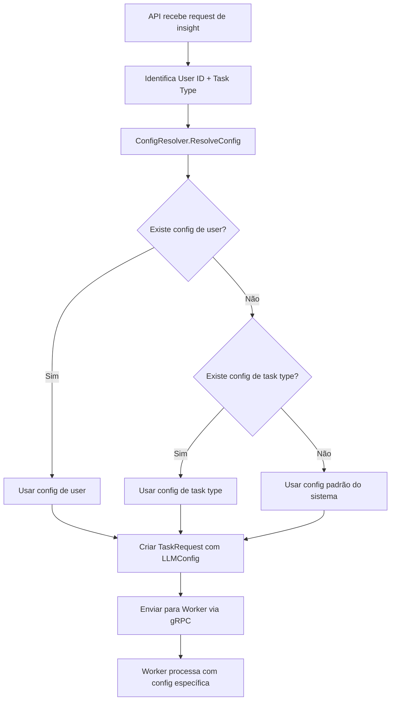

# Proposta: Sistema de Configuração Hierárquica de Modelos LLM

> "Configuration is the art of making systems adaptive without recompilation." - Martin Fowler ⚙️

## 1. **Problema Identificado**

Atualmente, o modelo LLM está hardcoded como `"llama3.2:3b"` em múltiplos locais:

1. **`internal/ai/ollama.go:117`** - Na geração de insights
2. **`internal/worker/client.go:237`** - No metadata de registro do worker
3. **Outros locais** - Possivelmente em health checks e relatórios semanais

### Limitações Atuais:
- ❌ **Inflexibilidade**: Impossível trocar modelo sem recompilação
- ❌ **Falta de Granularidade**: Mesmo modelo para todos os tipos de task
- ❌ **Manutenção Custosa**: Múltiplos pontos de alteração
- ❌ **Teste Limitado**: Difícil testar com modelos diferentes
- ❌ **Deploy Complexo**: Ambientes diferentes precisam de builds diferentes

## 2. **Proposta de Solução: Sistema Hierárquico de Configuração**

### **Hierarquia de Configuração (ordem de precedência)**

```
1. User-Level Config (mais específico) - sobrepõe tudo
   ↓
2. TaskType-Level Config (intermediário) - sobrepõe padrão
   ↓
3. System-Level Config (padrão) - base para tudo
```

### **Estrutura de Configuração Proposta**

```yaml
# Configuração Base (System-Level)
llm:
  default_model: "llama3.2:3b"
  fallback_model: "llama3.2:1b"  # Modelo de fallback para falhas
  timeout: "60s"
  max_retries: 3

  # Configurações por TaskType
  task_types:
    TASK_TYPE_INSIGHT_GENERATION:
      model: "llama3.2:3b"
      timeout: "45s"
      max_retries: 2

    TASK_TYPE_WEEKLY_REPORT:
      model: "llama3.2:7b"  # Modelo maior para relatórios
      timeout: "120s"
      max_retries: 3

    TASK_TYPE_DATA_ANALYSIS:
      model: "llama3.2:3b"
      timeout: "90s"
      max_retries: 3

  # Configurações por User (via database/API)
  user_preferences:
    # Será carregado dinamicamente do banco
    # Permite users premium terem modelos melhores
    premium_model: "llama3.2:7b"
    standard_model: "llama3.2:3b"
```

## 3. **Mudanças Necessárias**

### **3.1. Protocolo gRPC (proto/worker.proto)**

```protobuf
// Adicionar configuração de LLM na TaskRequest
message TaskRequest {
  string task_id = 1;
  TaskType task_type = 2;
  string payload = 3;
  int32 priority = 4;
  google.protobuf.Timestamp deadline = 5;
  map<string, string> metadata = 6;

  // NOVO: Configuração específica de LLM para esta task
  LLMConfig llm_config = 7;
}

// NOVO: Configuração de LLM
message LLMConfig {
  string model = 1;                    // Modelo específico (ex: "llama3.2:3b")
  int32 timeout_seconds = 2;           // Timeout para esta task
  int32 max_retries = 3;               // Máximo de tentativas
  string fallback_model = 4;           // Modelo de fallback
  map<string, string> parameters = 5;  // Parâmetros específicos do modelo
}

// Adicionar configuração de LLM no registro do worker
message RegisterWorkerRequest {
  string worker_id = 1;
  string worker_name = 2;
  repeated WorkerCapability capabilities = 3;
  string version = 4;
  map<string, string> metadata = 5;

  // NOVO: Configurações de LLM suportadas
  repeated string supported_models = 6;  // Modelos que o worker suporta
  LLMConfig default_llm_config = 7;      // Configuração padrão do worker
}
```

### **3.2. Configuração do Sistema (internal/config/config.go)**

```go
// WorkerConfig com configuração de LLM
type WorkerConfig struct {
	HealthPort         int
	WorkerID           string
	WorkerName         string
	Version            string
	OllamaURL          string
	MaxConcurrentTasks int

	// NOVO: Configuração de LLM
	LLM LLMConfig `yaml:"llm" json:"llm"`
}

// NOVO: Configuração hierárquica de LLM
type LLMConfig struct {
	DefaultModel   string                    `yaml:"default_model" json:"default_model"`
	FallbackModel  string                    `yaml:"fallback_model" json:"fallback_model"`
	Timeout        time.Duration             `yaml:"timeout" json:"timeout"`
	MaxRetries     int                       `yaml:"max_retries" json:"max_retries"`

	// Configurações por tipo de task
	TaskTypes      map[string]TaskLLMConfig  `yaml:"task_types" json:"task_types"`

	// Parâmetros específicos dos modelos
	ModelParams    map[string]ModelParams    `yaml:"model_params" json:"model_params"`
}

// Configuração específica por tipo de task
type TaskLLMConfig struct {
	Model      string        `yaml:"model" json:"model"`
	Timeout    time.Duration `yaml:"timeout" json:"timeout"`
	MaxRetries int           `yaml:"max_retries" json:"max_retries"`
}

// Parâmetros específicos do modelo
type ModelParams struct {
	Temperature   float64 `yaml:"temperature" json:"temperature"`
	MaxTokens     int     `yaml:"max_tokens" json:"max_tokens"`
	TopP          float64 `yaml:"top_p" json:"top_p"`
	ContextWindow int     `yaml:"context_window" json:"context_window"`
}
```

### **3.3. Service de Resolução de Configuração (internal/llm/resolver.go)**

```go
// NOVO: Service para resolver configuração hierárquica
type ConfigResolver struct {
	systemConfig *config.LLMConfig
	userService  UserPreferenceService
	cache        *sync.Map // Cache de configurações resolvidas
}

type ResolvedLLMConfig struct {
	Model         string
	Timeout       time.Duration
	MaxRetries    int
	FallbackModel string
	Parameters    map[string]interface{}
	Source        string // "user", "task_type", "system"
}

// Resolve configuração com hierarquia: user > task_type > system
func (r *ConfigResolver) ResolveConfig(ctx context.Context, userID string, taskType TaskType) (*ResolvedLLMConfig, error)

// Cache key para otimização
func (r *ConfigResolver) getCacheKey(userID string, taskType TaskType) string

// Invalida cache quando configuração muda
func (r *ConfigResolver) InvalidateCache(userID string)
```

### **3.4. Database Schema (nova tabela)**

```sql
-- NOVA: Tabela para preferências de LLM por usuário
CREATE TABLE user_llm_preferences (
    user_id UUID PRIMARY KEY REFERENCES users(id) ON DELETE CASCADE,

    -- Configuração geral do usuário
    preferred_model VARCHAR(100),
    fallback_model VARCHAR(100),
    timeout_seconds INTEGER DEFAULT 60,
    max_retries INTEGER DEFAULT 3,

    -- Configurações específicas por task type (JSONB)
    task_type_configs JSONB DEFAULT '{}',

    -- Metadados
    created_at TIMESTAMP WITH TIME ZONE DEFAULT NOW(),
    updated_at TIMESTAMP WITH TIME ZONE DEFAULT NOW(),

    -- Constraints
    CONSTRAINT valid_timeout CHECK (timeout_seconds > 0 AND timeout_seconds <= 300),
    CONSTRAINT valid_retries CHECK (max_retries >= 0 AND max_retries <= 10)
);

-- Índices para performance
CREATE INDEX idx_user_llm_preferences_user_id ON user_llm_preferences(user_id);

-- Trigger para updated_at
CREATE TRIGGER update_user_llm_preferences_updated_at
    BEFORE UPDATE ON user_llm_preferences
    FOR EACH ROW
    EXECUTE FUNCTION update_updated_at();
```

### **3.5. Service Layer (internal/services/llm_service.go)**

```go
// NOVO: Service para gerenciar configurações de LLM
type LLMConfigService struct {
	store    LLMConfigStore
	resolver *ConfigResolver
}

// Operações CRUD para configurações de usuário
func (s *LLMConfigService) GetUserLLMConfig(ctx context.Context, userID string) (*UserLLMConfig, error)
func (s *LLMConfigService) UpdateUserLLMConfig(ctx context.Context, userID string, config *UserLLMConfig) error
func (s *LLMConfigService) DeleteUserLLMConfig(ctx context.Context, userID string) error

// Resolver configuração para uma task específica
func (s *LLMConfigService) ResolveConfigForTask(ctx context.Context, userID string, taskType TaskType) (*ResolvedLLMConfig, error)

// Validar se modelo está disponível
func (s *LLMConfigService) ValidateModel(ctx context.Context, model string) error

// Listar modelos disponíveis
func (s *LLMConfigService) ListAvailableModels(ctx context.Context) ([]ModelInfo, error)
```

### **3.6. API Endpoints (internal/handlers/llm_config.go)**

```go
// NOVOS: Endpoints para gerenciar configurações de LLM

// GET /v1/users/llm-config - Obter configuração atual do usuário
func (h *LLMConfigHandler) GetUserLLMConfig(c *gin.Context)

// PUT /v1/users/llm-config - Atualizar configuração do usuário
func (h *LLMConfigHandler) UpdateUserLLMConfig(c *gin.Context)

// DELETE /v1/users/llm-config - Resetar para configuração padrão
func (h *LLMConfigHandler) ResetUserLLMConfig(c *gin.Context)

// GET /v1/llm/models - Listar modelos disponíveis
func (h *LLMConfigHandler) ListAvailableModels(c *gin.Context)

// GET /v1/llm/config/preview - Preview da configuração que seria usada
func (h *LLMConfigHandler) PreviewConfigForTask(c *gin.Context)
```

### **3.7. Modificações no Ollama Service (internal/ai/ollama.go)**

```go
// Modificar para usar configuração dinâmica
type OllamaService struct {
	logger         *logging.Logger
	baseURL        string
	client         *http.Client
	configResolver *ConfigResolver  // NOVO
}

// Atualizar método para usar configuração resolvida
func (s *OllamaService) GenerateInsightWithConfig(ctx context.Context, req *InsightRequest, llmConfig *ResolvedLLMConfig) (*Insight, error) {
	// Usar llmConfig.Model em vez de hardcoded
	response, err := s.generateWithTimeout(ctx, llmConfig.Model, prompt, llmConfig.Timeout)

	// Implementar fallback automático
	if err != nil && llmConfig.FallbackModel != "" {
		s.logger.Warn("Primary model failed, trying fallback",
			"primary_model", llmConfig.Model,
			"fallback_model", llmConfig.FallbackModel,
			"error", err)

		response, err = s.generateWithTimeout(ctx, llmConfig.FallbackModel, prompt, llmConfig.Timeout)
	}

	return insight, err
}
```

### **3.8. Worker Client (internal/worker/client.go)**

```go
// Modificar para resolver configuração antes de processar task
func (c *Client) processInsightTask(ctx context.Context, task *workerpb.TaskRequest) error {
	// NOVO: Resolver configuração de LLM para esta task
	llmConfig := task.LlmConfig
	if llmConfig == nil {
		// Fallback para configuração padrão
		llmConfig = c.getDefaultLLMConfig(task.TaskType)
	}

	// Converter para configuração interna
	resolvedConfig := &ai.ResolvedLLMConfig{
		Model:         llmConfig.Model,
		Timeout:       time.Duration(llmConfig.TimeoutSeconds) * time.Second,
		MaxRetries:    int(llmConfig.MaxRetries),
		FallbackModel: llmConfig.FallbackModel,
		Parameters:    llmConfig.Parameters,
	}

	// Usar configuração resolvida
	insight, err := c.aiService.GenerateInsightWithConfig(ctx, insightReq, resolvedConfig)
	// ...
}

// NOVO: Obter configuração padrão por tipo de task
func (c *Client) getDefaultLLMConfig(taskType workerpb.TaskType) *workerpb.LLMConfig {
	// Implementar lógica de fallback baseada no tipo de task
}
```

## 4. **Fluxo de Resolução de Configuração**

### **Diagrama de Fluxo**



### **Algoritmo de Resolução**

```go
func (r *ConfigResolver) ResolveConfig(ctx context.Context, userID string, taskType TaskType) (*ResolvedLLMConfig, error) {
	// 1. Tentar cache primeiro
	if cached := r.getFromCache(userID, taskType); cached != nil {
		return cached, nil
	}

	// 2. Iniciar com configuração padrão do sistema
	config := &ResolvedLLMConfig{
		Model:         r.systemConfig.DefaultModel,
		Timeout:       r.systemConfig.Timeout,
		MaxRetries:    r.systemConfig.MaxRetries,
		FallbackModel: r.systemConfig.FallbackModel,
		Source:        "system",
	}

	// 3. Sobrepor com configuração do task type (se existir)
	if taskConfig, exists := r.systemConfig.TaskTypes[string(taskType)]; exists {
		if taskConfig.Model != "" {
			config.Model = taskConfig.Model
		}
		if taskConfig.Timeout > 0 {
			config.Timeout = taskConfig.Timeout
		}
		if taskConfig.MaxRetries > 0 {
			config.MaxRetries = taskConfig.MaxRetries
		}
		config.Source = "task_type"
	}

	// 4. Sobrepor com configuração do usuário (se existir)
	if userConfig, err := r.userService.GetUserLLMConfig(ctx, userID); err == nil && userConfig != nil {
		if userConfig.PreferredModel != "" {
			config.Model = userConfig.PreferredModel
		}
		if userConfig.TimeoutSeconds > 0 {
			config.Timeout = time.Duration(userConfig.TimeoutSeconds) * time.Second
		}
		if userConfig.MaxRetries > 0 {
			config.MaxRetries = userConfig.MaxRetries
		}

		// Verificar configuração específica do task type do usuário
		if taskSpecific := userConfig.GetTaskTypeConfig(taskType); taskSpecific != nil {
			// Aplicar configurações específicas do task type
		}

		config.Source = "user"
	}

	// 5. Salvar no cache
	r.saveToCache(userID, taskType, config)

	return config, nil
}
```

## 5. **Configuração de Ambiente**

### **Variáveis de Ambiente**

```bash
# Configuração padrão de LLM
LLM_DEFAULT_MODEL=llama3.2:3b
LLM_FALLBACK_MODEL=llama3.2:1b
LLM_DEFAULT_TIMEOUT=60s
LLM_MAX_RETRIES=3

# Configurações por task type (JSON)
LLM_TASK_TYPE_CONFIGS='{"TASK_TYPE_INSIGHT_GENERATION":{"model":"llama3.2:3b","timeout":"45s"},"TASK_TYPE_WEEKLY_REPORT":{"model":"llama3.2:7b","timeout":"120s"}}'

# Parâmetros dos modelos (JSON)
LLM_MODEL_PARAMS='{"llama3.2:3b":{"temperature":0.7,"max_tokens":2048},"llama3.2:7b":{"temperature":0.6,"max_tokens":4096}}'
```

### **Arquivo de Configuração YAML**

```yaml
# config/llm.yaml
llm:
  default_model: "llama3.2:3b"
  fallback_model: "llama3.2:1b"
  timeout: "60s"
  max_retries: 3

  task_types:
    TASK_TYPE_INSIGHT_GENERATION:
      model: "llama3.2:3b"
      timeout: "45s"
      max_retries: 2

    TASK_TYPE_WEEKLY_REPORT:
      model: "llama3.2:7b"
      timeout: "120s"
      max_retries: 3

    TASK_TYPE_DATA_ANALYSIS:
      model: "llama3.2:3b"
      timeout: "90s"
      max_retries: 3

  model_params:
    "llama3.2:3b":
      temperature: 0.7
      max_tokens: 2048
      context_window: 8192

    "llama3.2:7b":
      temperature: 0.6
      max_tokens: 4096
      context_window: 16384
```

## 6. **Casos de Uso Exemplos**

### **Caso 1: Usuário Padrão - Insight Generation**
```
User: user_123 (sem configuração personalizada)
Task: TASK_TYPE_INSIGHT_GENERATION

Resolução:
1. Não existe config de user → skip
2. Existe config de task type → usar llama3.2:3b, timeout 45s
3. Config final: {model: "llama3.2:3b", timeout: 45s, source: "task_type"}
```

### **Caso 2: Usuário Premium - Weekly Report**
```
User: premium_user_456 (configuração: preferred_model = "llama3.2:7b")
Task: TASK_TYPE_WEEKLY_REPORT

Resolução:
1. Existe config de user → usar llama3.2:7b
2. Config de task type seria llama3.2:7b anyway
3. Config final: {model: "llama3.2:7b", timeout: 120s, source: "user"}
```

### **Caso 3: Fallback Automático**
```
User: user_789
Task: TASK_TYPE_INSIGHT_GENERATION
Cenário: llama3.2:3b falha

Fluxo:
1. Tenta llama3.2:3b → falha
2. Fallback automático para llama3.2:1b
3. Log: "Primary model failed, trying fallback"
4. Sucesso com modelo de fallback
```

## 7. **Benefícios da Solução**

### **7.1. Flexibilidade**
- ✅ **Runtime Configuration**: Trocar modelos sem redeploy
- ✅ **User Customization**: Usuários podem personalizar experiência
- ✅ **A/B Testing**: Testar diferentes modelos facilmente
- ✅ **Environment Specific**: Modelos diferentes por ambiente

### **7.2. Performance**
- ✅ **Model Optimization**: Modelos específicos para cada tipo de task
- ✅ **Timeout Tuning**: Timeouts otimizados por tipo de operação
- ✅ **Fallback Strategy**: Recuperação automática de falhas
- ✅ **Configuration Caching**: Cache para evitar recálculos

### **7.3. Operacional**
- ✅ **Observabilidade**: Logs detalhados sobre modelo usado
- ✅ **Rollback Capability**: Reverter mudanças rapidamente
- ✅ **Gradual Rollout**: Deploy incremental de novos modelos
- ✅ **Cost Optimization**: Usar modelos menores onde apropriado

### **7.4. User Experience**
- ✅ **Personalization**: Experiência personalizada por usuário
- ✅ **Premium Features**: Modelos melhores para usuários premium
- ✅ **Reliability**: Fallback automático aumenta disponibilidade
- ✅ **Transparency**: Usuários sabem qual modelo está sendo usado

## 8. **Riscos e Mitigações**

### **8.1. Riscos Identificados**

| Risco | Impacto | Probabilidade | Mitigação |
|-------|---------|---------------|-----------|
| **Complexidade Adicional** | Médio | Alto | Implementação incremental, boa documentação |
| **Performance Cache** | Baixo | Médio | Cache com TTL, invalidação inteligente |
| **Configuração Inválida** | Alto | Baixo | Validação rigorosa, testes automáticos |
| **Fallback Loops** | Alto | Baixo | Limite de tentativas, monitoring |

### **8.2. Estratégias de Mitigação**

1. **Implementação Incremental**
   - Fase 1: Sistema base + configuração por task type
   - Fase 2: Configuração por usuário
   - Fase 3: API de gerenciamento

2. **Validação Robusta**
   - Validar modelos na startup
   - Health checks dos modelos
   - Fallback para configuração conhecida

3. **Monitoring Extensivo**
   - Métricas de uso por modelo
   - Alertas para fallbacks frequentes
   - Dashboard de configurações ativas

## 9. **Cronograma de Implementação**

### **Fase 1: Foundation (1-2 semanas)**
- [ ] Definir protobuf com LLMConfig
- [ ] Implementar ConfigResolver básico
- [ ] Modificar OllamaService para aceitar configuração dinâmica
- [ ] Testes unitários

### **Fase 2: Integration (1-2 semanas)**
- [ ] Integrar ConfigResolver no Worker
- [ ] Implementar configuração por TaskType
- [ ] Migration database para user preferences
- [ ] Testes de integração

### **Fase 3: User Configuration (1-2 semanas)**
- [ ] API endpoints para configuração de usuário
- [ ] Service layer para LLM config
- [ ] Frontend para gerenciar configurações
- [ ] Testes end-to-end

### **Fase 4: Production Ready (1 semana)**
- [ ] Observabilidade e monitoring
- [ ] Documentation
- [ ] Performance testing
- [ ] Deploy em staging/production

## 10. **Considerações de Implementação**

### **10.1. Compatibilidade**
- Manter backward compatibility durante transição
- Suporte a configuração legacy via environment variables
- Migração gradual sem downtime

### **10.2. Security**
- Validar modelos permitidos por ambiente
- Audit log de mudanças de configuração
- Rate limiting nas APIs de configuração

### **10.3. Testing**
- Mock diferentes configurações em testes
- Testes de performance com diferentes modelos
- Chaos engineering para cenários de fallback

---

Esta proposta fornece uma base sólida para implementar configuração hierárquica de modelos LLM. O próximo passo é refinar os detalhes específicos e começar a implementação incremental.
